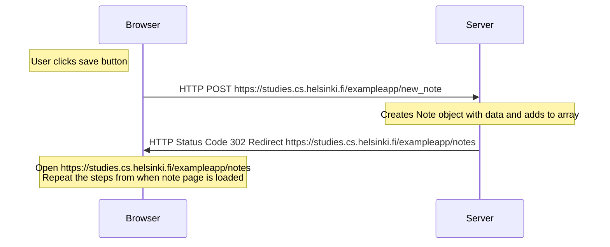

```mermaid
sequenceDiagram
Note left of Browser: User clicks save button
Browser->>Server: HTTP POST https://studies.cs.helsinki.fi/exampleapp/new_note
Note over Server: Creates Note object with data and adds to array
Server->>Browser: HTTP Status Code 302 Redirect https://studies.cs.helsinki.fi/exampleapp/notes
Note over Browser: Open https://studies.cs.helsinki.fi/exampleapp/notes <br/> Repeat the steps from when note page is loaded
```
