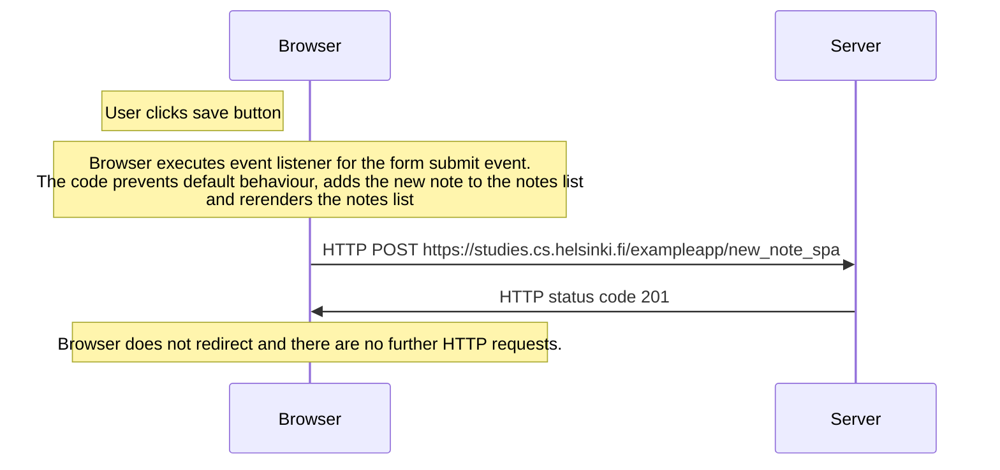

```mermaid
sequenceDiagram
Note left of Browser: User clicks save button
Note over Browser: Browser executes event listener for the form submit event. <br/> The code prevents default behaviour, adds the new note to the notes list <br/> and rerenders the notes list
Browser->>Server: HTTP POST https://studies.cs.helsinki.fi/exampleapp/new_note_spa
Server->>Browser: HTTP status code 201
Note over Browser: Browser does not redirect and there are no further HTTP requests.
```
